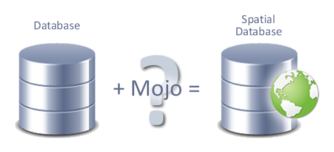
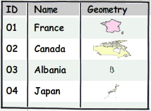
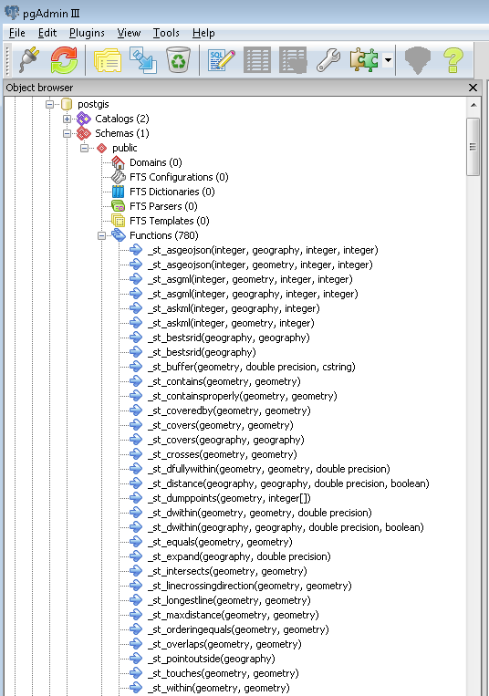
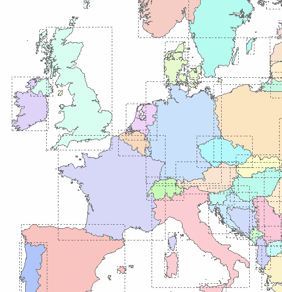

.. _postgis.spatialdbs:

Spatial Databases
=================

In this section we'll look at the factors that make a spatial database special.

What is a spatial database?
---------------------------

What makes an ordinary database a spatial database?

   Is it...mojo?

Spatial databases store and manipulate spatial objects like any other object in the database.

There are three extra factors that allow spatial objects to exist natively in a database:

#. **Spatial data types**, for storing shapes like points, lines, and polygons in geometry columns
#. **Spatial functions**, posed in `SQL <http://en.wikipedia.org/wiki/SQL>`_ (Structured Query Language) for querying spatial properties and relationships
#. **Spatial indexes**, used for efficient processing of spatial operations

Spatial data types
------------------

**Spatial data types** store shapes like points, lines, and polygons in geometry columns.  They can be understood simply as a binary representation of a shapes in a database row (with location).

   Database with geometry (conceptual)
   
Spatial data types are organized in a type hierarchy. Each sub-type inherits the structure (properties) and the behavior (methods or functions) of its super-type. 

.. figure:: img/hierarchy.png

   Data type hierarchy

Spatial functions
-----------------

**Spatial functions**, posed in SQL, are for querying spatial properties and relationships.

To manipulate data during a query, an ordinary database provides **functions** for operations such as (but not limited to):

* Operating mathematically on numbers
* Extracting information from dates
* Working with strings

In addition to these "base type" functions, a spatial database provides a functions for operating on geometries.

Spatial functions are commonly categorized by their category of operation:

* Management 

   * Make me a new geometry column in a table (**AddGeometryColumn**)
   * Update all of the existing geometry columns (**Populate_Geometry_Columns**)

* Conversion 

   * Show the text representation of this point (**ST_AsText**)
   * Convert this text string into a valid PostGIS geometry (**ST_GeomFromText**)   

* Retrieval

   * How long is this line? (**ST_Length**)
   * What is the perimeter of Uzbekistan? (**ST_Perimeter**)

* Comparison

   * Is France next to Finland? (**ST_Touches**)
   * Is Paris in China? (**ST_Contains**)

* Generation

   * Calculate a 20km exclusion limit around Moose Factory! (**ST_Buffer**)
   * Consolidate New York and New Jersey! (**ST_Union**)

   List of some PostGIS functions (as viewed in pgAdmin)

Spatial Indexes
---------------

Multi-dimensional **spatial indexes** are used for efficient processing of spatial operations.

Indexes for basic data types such as numbers, strings, and dates are relatively easy to compute, as their natural sort orders are simple to determine.  Every value is less than, greater than, or equal to every other value.

A decent analogy is an indexing system that we likely use daily:

   A typical sorting algorithm known as "alphabetical order"

Indexes for geometries are not so simple. Since polygons can overlap, can be contained in one another, and are arrayed in a two-dimensional (or greater) space, the notion of a natural sort order doesn't apply.

Spatial indexes work around this added complexity by computing and comparing each feature's bounding box (BBOX).  A bounding box is the smallest sized rectangle capable of containing a given feature in its entirety.

Even the most complex polygons and linestrings can be represented by a simple bounding box.

   Bounding boxes of geographical features

Bounding boxes are used to answer questions such as "Which countries are next to France?", since the question is very computationally intensive for polygons and complex lines, but much simpler in the case of rectangles.  However, the comparison of bounding rectangles isn't as accurate as comparing exact geometries.  So spatial indexes provide approximate results in a first pass, which are then honed to an exact result in a second pass.

With large, complex datasets, it is *much faster* to compute exact results from the subset of approximate candidates obtained through bounding box analysis, rather than to sequentially scan relationships between entire feature-sets in one pass.