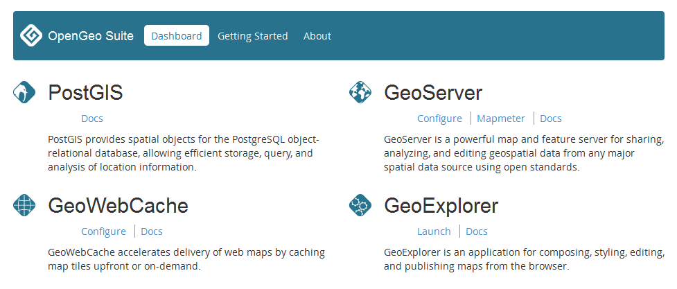

.. _suite.dashboard:

OpenGeo Suite Dashboard
=======================

OpenGeo Suite comes with a Dashboard, a lightweight web application that provides links to the most common applications and documentation.

As we introduce the Dashboard, take some time to explore it by clicking around.

The Dashboard can be opened from the Start menu at :menuselection:`OpenGeo Suite --> Dashboard`. The Dashboard is also available in the browser by navigating to ``http://localhost:8080/``.

Home screen
-----------

The main Dashboard page show links to PostGIS configuration and documentation for PostGIS, GeoServer, GeoWebCache, and GeoExplorer.

   OpenGeo Suite Dashboard

.. note:: A link to pgAdmin is not included here because the Dashboard can only launch web pages, not desktop applications. pgAdmin can be launched from the Start Menu.
   
Getting started
---------------

The Getting Started screen includes a sample workflow to use for publishing data and maps using OpenGeo Suite. A similar workflow will be followed as part of this workshop.

About
-----

The About page contains information about OpenGeo Suite and Boundless, the company behind OpenGeo Suite.

Other ways of accessing components
----------------------------------

The OpenGeo Suite Dashboard is designed as a convenience to users, but it is not the only way to access components.

* **Desktop tools** such as **pgAdmin** and **pgShapeloader** can be launched through the Start Menu under :menuselection:`OpenGeo Suite --> pgAdmin/pgShapeloader`.

* All **web applications** such as **GeoServer** can be accessed directly through the browser. OpenGeo Suite runs locally at the port where it was installed (the default is 8080). Some helpful URLs for this workshop are:

  * GeoServer - ``http://localhost:8080/geoserver``
  * GeoWebCache - ``http://localhost:8080/geowebcache``
  * GeoExplorer - ``http://localhost:8080/geoexplorer``

