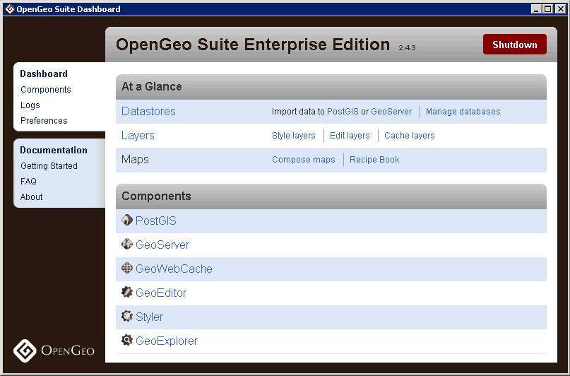
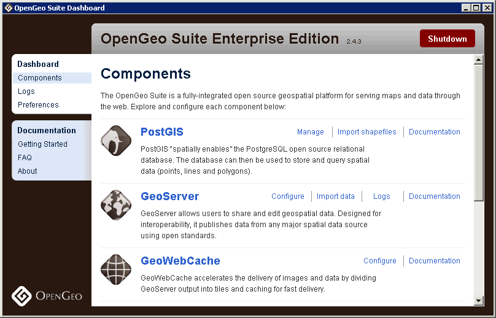
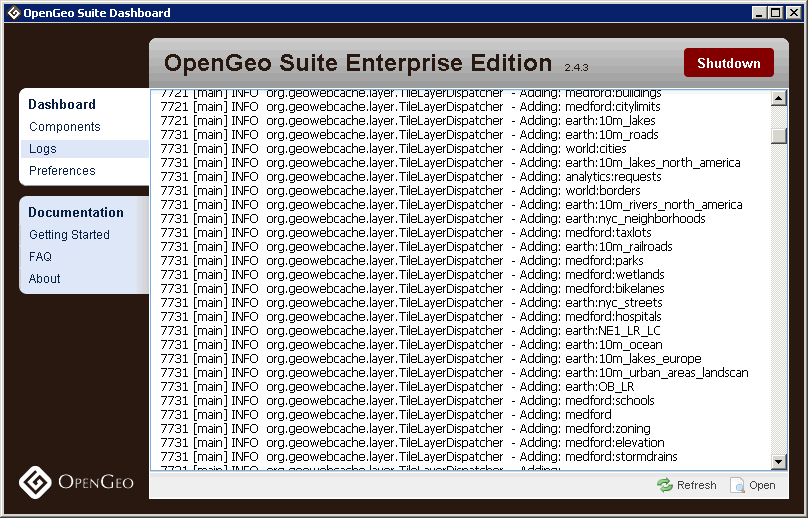
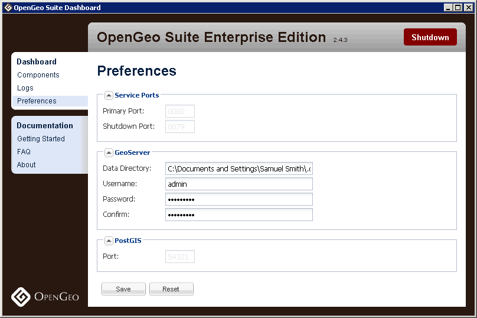
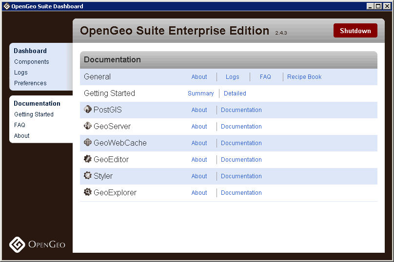

.. _suite.dashboard:

OpenGeo Suite Dashboard
=======================

In this section, we'll dig a bit deeper and familiarize you with the Dashboard's functions and content.

As we introduce the Dashboard, take some time to explore it by clicking around.

We had a quick look at the Dashboard at the end of the previous section when it launched automatically following our installation of OpenGeo Suite. 

* The Dashboard provides a central interface for accessing the various components of OpenGeo Suite.
* The Dashboard also provides links to a variety of documentation and information sources for users of all levels.

The Dashboard should already be open; however, if it is not, you can always launch it manually from the Start Menu at :menuselection:`Start --> Programs --> OpenGeo Suite --> OpenGeo Suite Dashboard`.

.. note:: The Dashboard is also available in the browser by navigating to ``http://localhost:8080/dashboard``.

Home screen
-----------

The (default) *Dashboard* tab is divided into two sections, an :guilabel:`At a Glance` panel, and a :guilabel:`Components` panel.

   OpenGeo Suite Dashboard
   
At a Glance panel
~~~~~~~~~~~~~~~~~

The *At a Glance* panel provides quick access to a set of tools that allow you to:

#. Load and manage data in PostGIS and GeoServer (Datastores)
#. Style, edit, and optimize the presentation of your map layers (Layers)
#. Compose maps and mapping applications through examples (Maps)
  
Components panel
~~~~~~~~~~~~~~~~

The *Components* panel presents a list of links and launchers to tools and documents for each of the OpenGeo Suite components.

Mousing over rows in this list exposes the links/launchers available for each component; hovering over a link/launcher pops-up a tool-tip with the name of the target application or document. 

Components tab
~~~~~~~~~~~~~~

The *Components* tab reiterates the list of OpenGeo Suite components, but with more detailed descriptions of the applications.

   OpenGeo Suite Dashboard Components tab

Logs tab
~~~~~~~~

The *Logs* tab presents the log files for your installation. These logs generally just keep you posted about the status of various OpenGeo Suite services; however, if there are ever issues with your software, the content in this section can provide you with valuable troubleshooting information.

Logs are also available in the GeoServer web interface, which we will see later on in this workshop.

   OpenGeo Suite Dashboard Logs tab

Preferences tab
~~~~~~~~~~~~~~~

The *Preferences* tab is an interface for viewing and configuring some of the OpenGeo Suite settings.

   OpenGeo Suite Dashboard Preferences tab

#. **Service Ports** lists the *Primary Port* and *Shutdown Port* on which GeoServer and (servlet container) web applications are running. (Values in this section can only be changed when OpenGeo Suite is not running.)

#. **GeoServer** lists the *Data Directory* base path that GeoServer uses for spatial files, and the *Username* and *Password* used to authenticate to GeoServer for administration.  (This was the same information that was displayed on the initial Dashboard pop-up.)

#. **PostGIS** lists the *Port* on which PostGIS is accessible. (Values in this section can only be changed when OpenGeo Suite is not running.)

We won't make any changes here now, but if you ever choose to, remember to click the :guilabel:`Save` button to write your changes into configuration files, and then restart OpenGeo Suite to effect the changes.

To reset to the default configuration, click the :guilabel:`Reset` button.
 
Documentation tab
-----------------

The *Documentation* tab presents a variety of links to information designed to help you get started using OpenGeo Suite. For example, the *Getting Started* page describes a common, a high-level workflow for getting your data served and published on the web using the Suite stack.

   A guide for getting your data served on the web using OpenGeo Suite

Explore the other links to get more detailed information about OpenGeo Suite and its various components. Note that many of the links will launch your browser and take you to the appropriate configuration and/or demonstration web pages.

.. note:: OpenGeo Suite must be online in order to view documentation through the Dashboard. If you would like to view the documentation when OpenGeo Suite is offline, you can use the shortcuts in the Start Menu at :menuselection:`Start Menu --> All Programs --> OpenGeo Suite --> Documentation --> <Application Name>`.

Other ways of accessing components
----------------------------------

The OpenGeo Suite Dashboard is designed as a convenience to users, but it is not the only way to access components.

* **Desktop tools** such as **pgAdmin** and **pgShapeloader** can be launched through the Start Menu under :menuselection:`Start Menu --> All Programs --> OpenGeo Suite --> <Application Name>`.

* All **web applications** such as **GeoServer** can be accessed directly through the browser. OpenGeo Suite runs locally at the port where it was installed (the default is 8080). Some helpful URLs for this workshop are:

   * GeoServer - ``http://localhost:8080/geoserver``
   * GeoWebCache - ``http://localhost:8080/geowebcache``
   * GeoExplorer - ``http://localhost:8080/geoexplorer``

* Finally, it is possible to start and stop OpenGeo Suite using links in the Start Menu, or by navigating to the root of the installation directory in a Command Prompt, and typing the following::

    opengeo-suite start

::
    opengeo-suite stop

